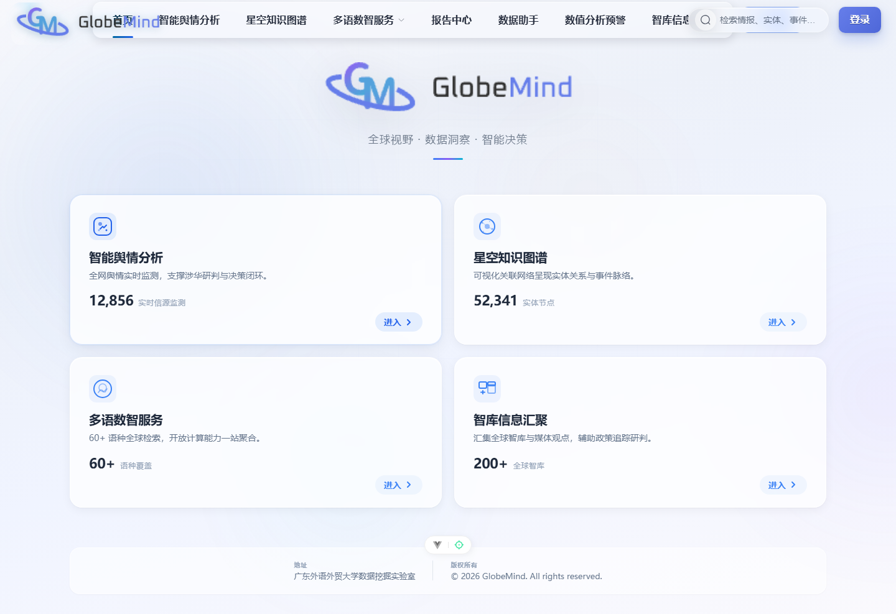
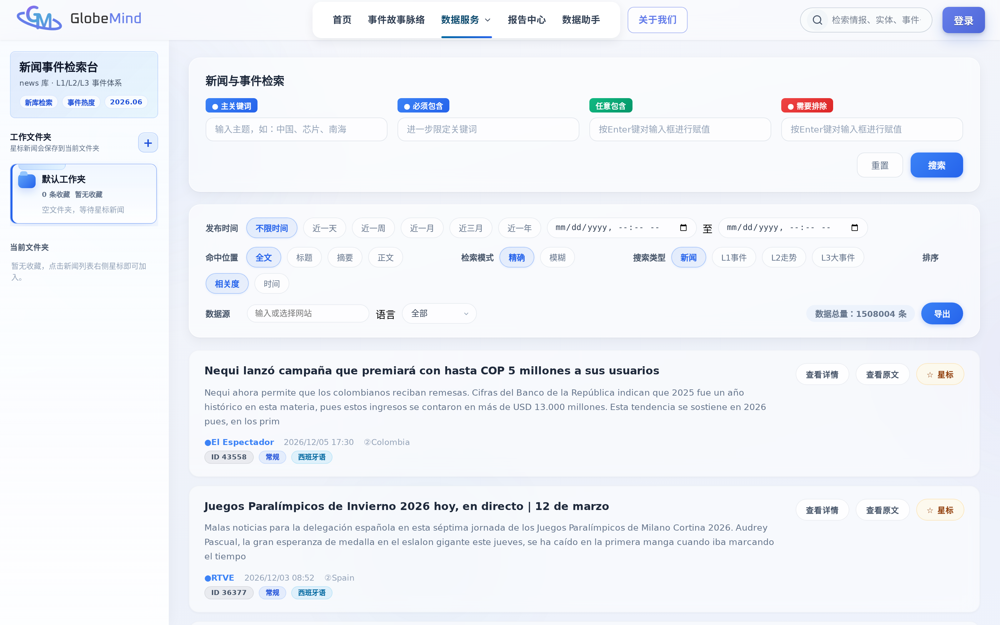
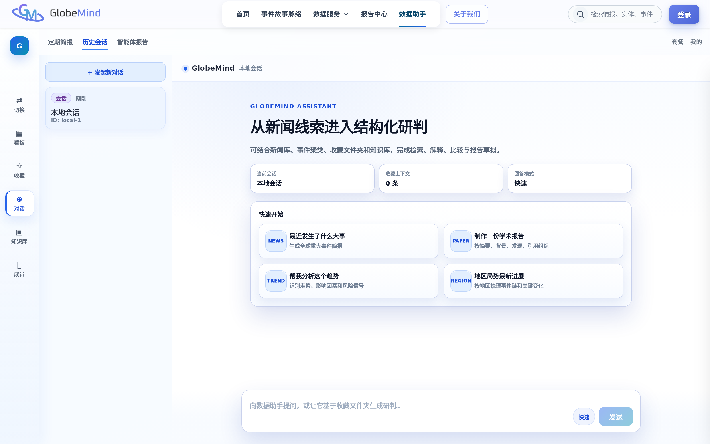
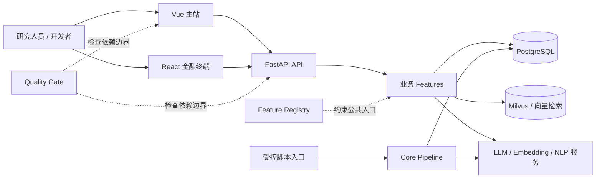

<div align="center">
  

  <p><strong>面向全球新闻研究的地缘情报、事件脉络与舆情分析平台</strong></p>
  <p>把多语言新闻组织为可检索的资料、事件簇、叙事线、证据链与研究工作流。</p>

  [](https://github.com/heroday11/globemind/actions/workflows/quality-gate.yml)
  [](pyproject.toml)
  [](package.json)
  [](VERSION)
  [](LICENSE_DECISION.md)

  [快速开始](#快速开始-quick-start) ·
  [新人接手指南](#新人接手指南-developer-onboarding) ·
  [系统架构](#系统架构-architecture) ·
  [文档导航](#文档导航-documentation) ·
  [参与开发](CONTRIBUTING.md)
</div>



> [!IMPORTANT]
> GlobeMind 是包含 Web 应用、研究算法、数据治理和受控部署工具的 monorepo。
> 仓库代码可以独立审阅和测试，但完整 AI 能力还需要 PostgreSQL、模型、向量服务、
> 外部数据源及相应授权。代码存在不等于真实数据、模型质量或生产发布已经验收。

## 项目概述 Overview

新闻研究的难点通常不是“找到一篇文章”，而是把不同语言、不同来源和不同时间的报道组织成可验证的研究材料。GlobeMind 围绕这个过程提供一套组合能力：

- 从全球新闻资料中检索文章、实体、事件与来源；
- 将相关报道聚合为事件簇、趋势链和 L3 大事件脉络；
- 通过证据快照、来源信息和治理记录保留结论依据；
- 为分析人员提供研究工作区、数据助手、舆情与金融观察界面；
- 对模型评测、数据来源、身份权限和运行状态实施可审计治理。

项目当前更适合研究开发、内部分析平台建设和可验证原型，不应被描述为无需配置即可使用的公共情报服务。

## 核心能力 Capabilities

| 能力 | 解决的问题 | 主要实现 |
| --- | --- | --- |
| 新闻与事件检索 | 跨来源、语言、时间和事件层级定位资料 | Search feature、PostgreSQL、可选 Milvus |
| 事件聚类与叙事线 | 将分散报道组织为 L1/L2/L3 事件脉络 | `core_pipeline/`、Agentic RAG、Story Graph |
| 数据助手与研究工作区 | 对检索结果、工作区材料和报告进行辅助分析 | Assistant、Research Workflow |
| 舆情与观点分析 | 分析情感、趋势、指标语义和质量信号 | Opinion/Sentiment features |
| 证据与数据治理 | 保存来源、快照、审批记录和模型评测证据 | Evidence、Entity/Data/Model Governance |
| 金融与运行观察 | 展示金融信号、告警和系统健康状态 | Financial Terminal、Operations |

<details>
<summary><strong>查看更多产品界面</strong></summary>

### 新闻与事件检索



### L3 大事件脉络图谱


### 数据助手



截图用于展示产品交互和研究工作流，不代表截图中的数据量、实时性或模型结果已经在当前环境完成生产验收。

</details>

## 系统架构 Architecture



代码依赖遵循以下方向：

```text
后端：composition root → feature → domain / platform
前端：application shell → feature public API → shared workspace
管线：scripts entrypoint → core_pipeline
```

当前已经通过 feature registry 和 CI 固定公共边界，但旧 `routes/services/views`
兼容层仍在逐步迁移。不要把目标架构误认为所有内部迁移已经完成。详细现状见
[模块边界与迁移地图](docs/architecture/module-map.md)和
[Feature Registry 说明](docs/architecture/feature-registry.md)。

## 仓库结构 Repository map

| 路径 | 职责 | 从这里继续阅读 |
| --- | --- | --- |
| `backend/api/` | FastAPI、身份、搜索、助手、治理和业务 API | [API 说明](backend/api/README.md) |
| `backend/agentic_rag/` | 检索、涉华分析、事件/故事处理和模型适配 | [Agentic RAG](backend/agentic_rag/README.md) |
| `backend/ai_search/` | AI Search 独立边界与兼容入口 | [AI Search](backend/ai_search/README.md) |
| `backend/tests/` | 单元、契约、安全、架构和集成边界测试 | [后端总览](backend/README.md) |
| `frontend/vue_project/` | Vue 3/Vite 主站 | [主前端说明](frontend/vue_project/README.md) |
| `frontend/financial-terminal/` | React 金融终端 | [金融终端说明](frontend/financial-terminal/README.md) |
| `frontend/shared/` | 前端 workspace 间共享的类型和工具 | [前端总览](frontend/README.md) |
| `core_pipeline/` | 事件抽取、共指聚类和实体规范化算法 | [Pipeline 说明](core_pipeline/README.md) |
| `scripts/` | 数据、评估、审计和维护命令入口 | [脚本分类索引](scripts/README.md) |
| `config/` | 配置导航、环境变量目录和角色样例 | [配置说明](config/README.md) |
| `data/` | 受版本控制的样例、研究数据和数据清单 | [数据边界](data/README.md) |
| `deploy/` | 构建、候选验证、发布和运行控制工具 | [部署边界](deploy/README.md) |
| `ops/` | Feature、运行时和发布事实清单 | [运维清单](ops/README.md) |
| `quality/` | CI 预算、边界和 ratchet 基线 | [质量契约](quality/README.md) |
| `docs/` | 当前开发、架构、运维参考与历史证据 | [文档索引](docs/README.md) |
| `remotion-edit/` | 独立视频演示编辑工具 | [Remotion 说明](remotion-edit/README.md) |

## 快速开始 Quick start

### 前置条件

- Git；
- Python 3.11；
- Node.js 22 与 npm；
- 开发 API 时需要本地 PostgreSQL；
- 模型和向量路径按目标功能另行准备，不是前端开发的必需条件。

### 1. 获取代码并安装开发依赖

```bash
git clone https://github.com/heroday11/globemind.git
cd globemind

python3.11 -m venv .venv
. .venv/bin/activate
PYTHONDONTWRITEBYTECODE=1 python -B -m pip install -r requirements-dev.txt

npm ci
```

也可以使用仓库入口：

```bash
make install-python
make install-web
```

根目录 `requirements.txt` 包含较重的模型和离线分析依赖。仅开发 Web/API 时不要默认安装它；进入相应 AI 或 pipeline 任务后，再阅读模块文档并选择对应依赖。

### 2. 只运行主前端

最快的新人接手路径是不连接数据库，使用受控本地 mock：

```bash
make dev-web-mock
```

需要连接本地 API 时再准备前端环境：

```bash
test -e frontend/vue_project/.env.local || \
  cp frontend/vue_project/.env.example frontend/vue_project/.env.local
npm run dev:web
```

根据 `.env.example` 设置 `VITE_API_PROXY_TARGET`。如果明确启用 mock，只能用于界面开发，不表示后端或 AI 管线已经可用。

### 3. 运行本地 API

先准备隔离的本地 PostgreSQL 和 API 配置：

```bash
test -e backend/api/.env || cp backend/api/.env.example backend/api/.env
# 编辑 backend/api/.env，只填写本地开发配置，不要使用生产凭据

make dev-api
```

默认开发地址为 `http://127.0.0.1:8088`。数据库或必要 schema 不可用时，API 会失败关闭，不会伪装成完整可用状态。

### 4. 验证开发环境

```bash
# Python 与前端离线测试
make test

# 完整受控质量门禁
make quality
```

也可以分开运行：

```bash
PYTHONDONTWRITEBYTECODE=1 python -B -m pytest -q
npm run lint
npm run typecheck
npm test
npm run build
```

带 `integration`、`live_db`、`gpu` 或 `slow` 标记的测试需要额外服务、数据或硬件。普通贡献不应连接生产数据库，也不要为了让门禁通过而删除或弱化这些边界。

## 新人接手指南 Developer onboarding

如果你第一次接触 GlobeMind，建议按任务而不是按文件数量阅读：

| 你准备做什么 | 建议阅读顺序 | 第一个验证命令 |
| --- | --- | --- |
| 了解产品和当前状态 | 本页 → [文档索引](docs/README.md) → [持续改进总控](docs/GLOBEMIND_CONTINUOUS_IMPROVEMENT_MASTER_20260809.md) | `make quality` |
| 修改 Vue 主站 | [前端总览](frontend/README.md) → [Vue README](frontend/vue_project/README.md) → 对应 `features/*/index.js` | `npm run test:web` |
| 修改金融终端 | [金融终端 README](frontend/financial-terminal/README.md) | `npm run test:financial` |
| 修改 API/业务功能 | [后端总览](backend/README.md) → [API README](backend/api/README.md) → [模块地图](docs/architecture/module-map.md) | `make test-python` |
| 修改事件聚类或离线算法 | [Core Pipeline](core_pipeline/README.md) → [L1 Pipeline](docs/L1_MAIN_PIPELINE.md) | 运行目标模块测试，不启动长管线 |
| 修改配置或数据库边界 | [配置导航](config/README.md) → [运行时配置](config/runtime/README.md) → [数据库角色](docs/operations/DATABASE_RUNTIME_ROLES.md) | `make quality` |
| 修改发布或运行工具 | [AGENTS.md](AGENTS.md) → [Deploy README](deploy/README.md) → [发布手册](docs/operations/RELEASES.md) | 仅运行文档允许的离线验证 |

开发某个业务 feature 时遵循以下规则：

1. 在 [`ops/features/registry.json`](ops/features/registry.json) 确认 owner、公共入口、路由、页面和契约测试。
2. 后端跨 feature 只导入 `backend/api/features/<feature>/__init__.py` 暴露的接口。
3. 前端跨 feature 只导入对应 `features/<feature>/index.js` 公共入口。
4. 不在业务模块直接读取环境变量、创建全局数据库连接或依赖脚本入口。
5. 修改行为时同步更新契约测试和相应模块文档。

## 开发状态 Project status

| 范围 | 状态 | 说明 |
| --- | --- | --- |
| Vue 主站与 FastAPI | 活跃开发 | 可以独立安装、测试；完整页面依赖本地数据库/API |
| Feature 公共边界 | 已验证 | Registry、公共入口和导入门禁由 CI 检查 |
| 内部模块迁移 | 持续进行 | 旧 route/service/view 兼容层尚未全部移除 |
| Agentic RAG 与模型能力 | 条件可用 | 需要模型、权重、计算资源、Milvus/LLM 配置 |
| 数据与生产可用性 | 需单独验收 | 测试通过不代表来源授权、数据新鲜度或模型质量已验收 |
| 开源许可 | 待决定 | 外部使用或再分发前阅读 [LICENSE_DECISION.md](LICENSE_DECISION.md) |

## 文档导航 Documentation

### 开发与协作

- [完整文档索引](docs/README.md)
- [贡献指南](CONTRIBUTING.md)
- [自动化与生产安全规则](AGENTS.md)
- [安全政策](SECURITY.md)
- [开发整理与模块化路线](docs/DEVELOPMENT_PLAN.md)
- [本地开发模式](docs/development/LOCAL_DEVELOPMENT.md)
- [测试指南](docs/development/TESTING.md)
- [GitHub 协作配置](.github/GOVERNANCE.md)

### 架构与契约

- [模块边界与迁移地图](docs/architecture/module-map.md)
- [Feature Registry 说明](docs/architecture/feature-registry.md)
- [仓库治理契约](docs/REPOSITORY_GOVERNANCE.md)
- [数据库结构参考](docs/DB_SCHEMA_GLOBEMIND.md)
- [新闻字段映射](docs/NEWS_TABLE_FIELD_MAPPING.md)

### 运行与发布

- [Python 运行时](docs/operations/PYTHON_RUNTIME.md)
- [发布、验证与回滚](docs/operations/RELEASES.md)
- [运行控制](docs/operations/RUNTIME_CONTROL.md)
- [运行服务目录](docs/operations/RUNTIME_SERVICE_CATALOG.md)
- [持续审计](docs/operations/CONTINUOUS_AUDIT.md)

历史 handoff、benchmark、实验和旧 CLI 文档保留为证据，不是当前执行入口。请从 [docs/README.md](docs/README.md) 的 Current、Architecture、Operations 和 Archive 分类进入。

## 参与开发 Contributing

欢迎提交问题和改进，但请先阅读 [CONTRIBUTING.md](CONTRIBUTING.md)：

1. 从 Issue 或明确的问题范围开始；
2. 保持提交单一目的，并说明不在范围内的事项；
3. 新增 API、数据或模型时同时补充契约、权限、来源和测试；
4. 提交前运行相关测试以及 `make quality`；
5. 不提交 `.env`、数据库导出、token、模型密钥、日志或本地运行状态。

GitHub 已配置 CODEOWNERS、Issue 模板、Pull Request 模板、Dependabot 和统一质量门禁。

## 安全与生产边界 Security

生产 release 是不可修改的证据边界。开发者不得运行或导入生产 release、`previous`、`rejected` 或版本化发布目录中的 Python，不得把发布目录加入 `PYTHONPATH`，也不得根据 PID 文件或命令名猜测并操作服务。

数据库迁移、发布提升、运行控制和长时间 pipeline 操作必须遵循 [AGENTS.md](AGENTS.md) 及对应 [operations runbook](docs/operations/)。普通开发命令不授权访问生产数据库、停止服务或启动抓取和长管线。

发现安全问题时，请按 [SECURITY.md](SECURITY.md) 私下报告，不要在公开 Issue 中提交密钥、个人数据或可利用细节。

## License

项目许可证尚未确定。代码、数据集、模型、媒体和文档可能具有不同的权利边界；在复制、分发或商业使用前，请阅读 [LICENSE_DECISION.md](LICENSE_DECISION.md)。仓库公开可见不等于授予开源许可。
