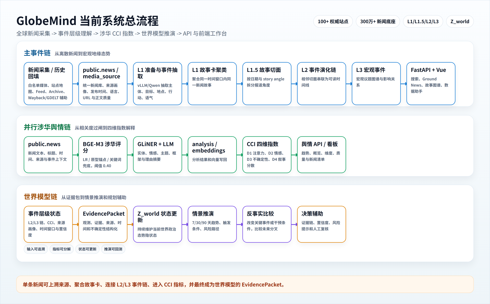
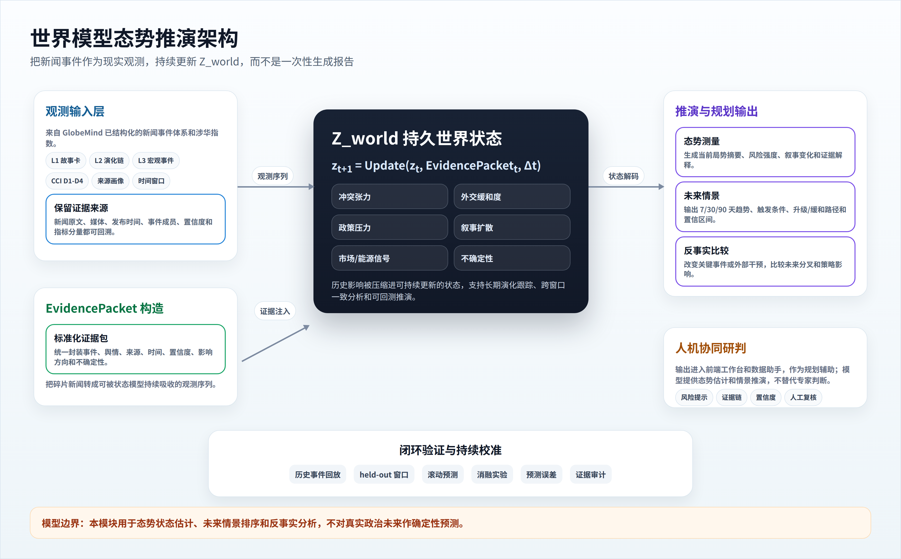
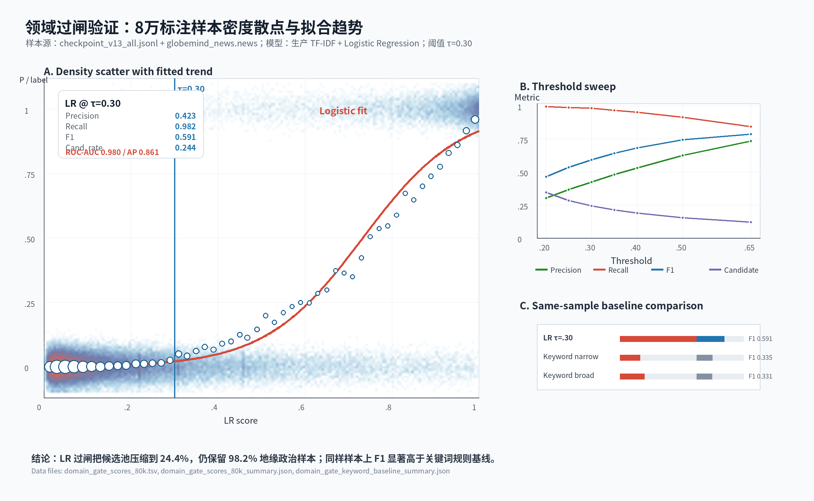
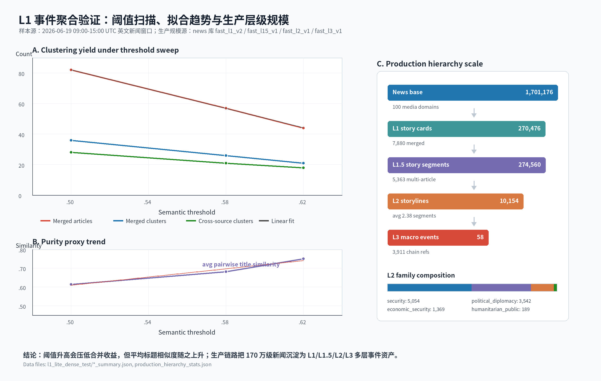
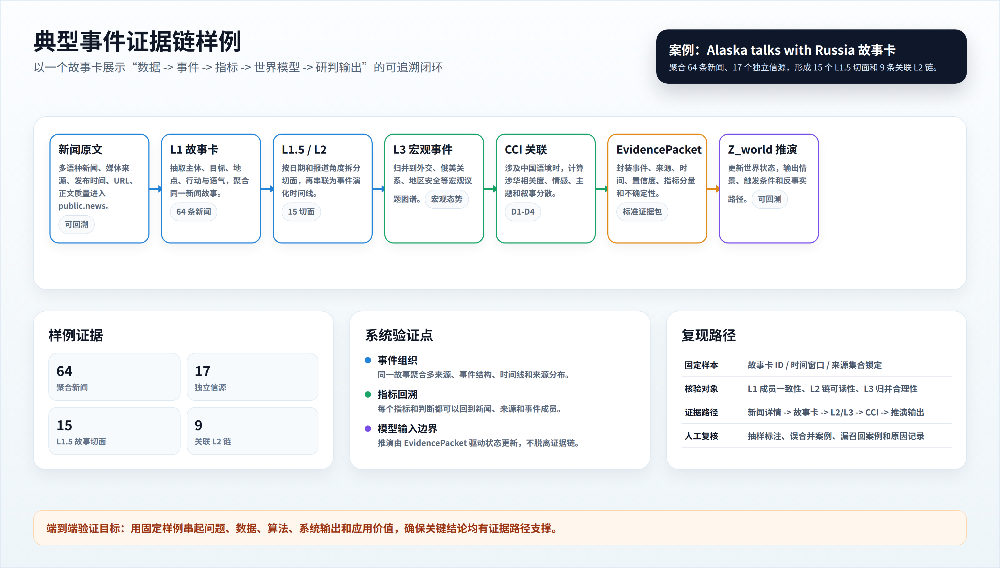
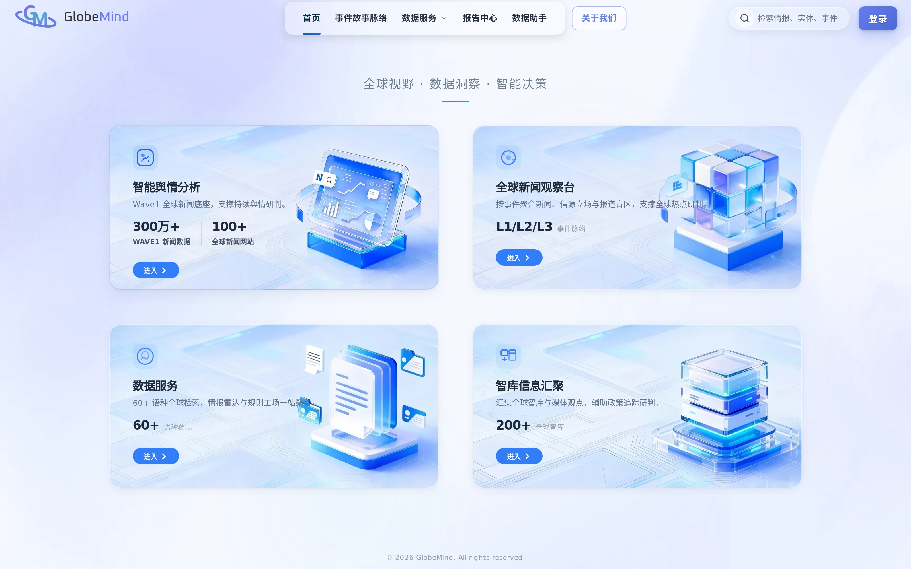
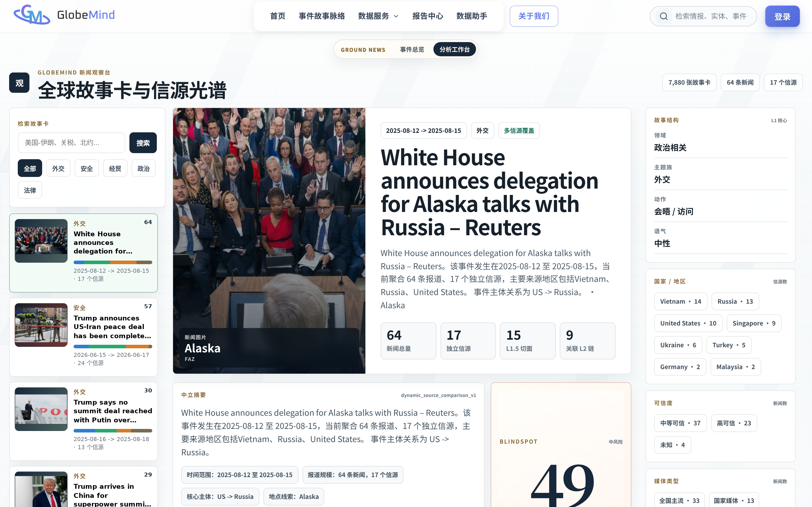
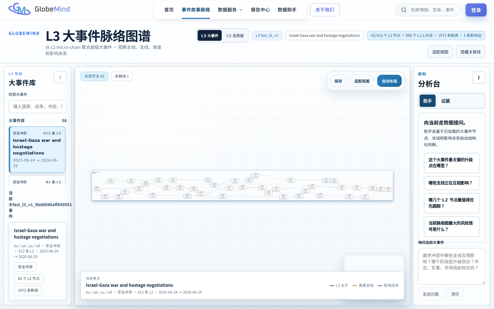
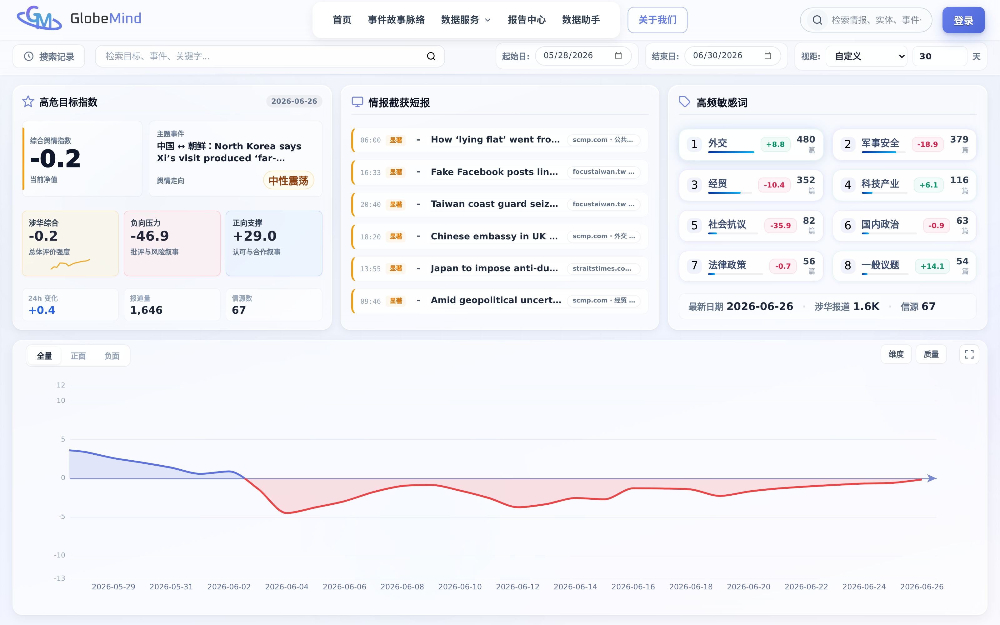

__2026年（第19届）__

__中国大学生计算机设计大赛__

大数据实践赛作品报告

作品编号：2026005702　　　　　　　　　　　　　　　　

作品名称：GlobeMind：多语言地缘情报与世界模型态势推演平台

填写日期：2026\.6\.30

__目  录__

第1章 作品概述	1

1\.1 创意背景	1

1\.2 用户群体	1

1\.3 主要功能与特色	1

1\.4 应用价值	2

1\.5 推广前景	3

第2章 问题分析	3

2\.1 问题来源	3

2\.2 现有方案与待解决痛点	4

2\.3 解决问题的思路	4

2\.3\.1 新闻重复与事件割裂	4

2\.3\.2 涉华判断粗糙	4

2\.3\.3 未来规划缺少模型支撑	5

2\.3\.4 证据链与可解释性不足	5

2\.4 功能需求	5

2\.5 性能需求	5

2\.6 数据集	6

第3章 技术方案	6

3\.1 总体技术框架	6

3\.2 数据采集与来源治理模块	7

3\.2\.1 来源可信度与覆盖分析	7

3\.2\.2 历史回填与实时刷新	8

3\.2\.3 采集质量控制与合规边界	8

3\.3 L1/L1\.5/L2/L3 事件体系	9

3\.3\.1 L1 事件抽取与故事卡	9

3\.3\.2 L1\.5 切面与 L2 演化链	9

3\.3\.3 L3 宏观事件与图谱	10

3\.4 涉华舆情分析与 CCI 指数模块	10

3\.4\.1 BGE\-M3 涉华评分与过闸	10

3\.4\.2 GLiNER \+ LLM 精细分析	10

3\.4\.3 CCI 四维指数建模	11

3\.5 世界模型态势推演模块	11

3\.5\.1 情景输出与反事实分析	12

3\.6 API 与前端工作台模块	12

3\.6\.1 FastAPI 服务	12

3\.6\.2 Ground News 工作台	12

3\.6\.3 舆情看板与故事图谱	13

3\.7 安全与生产化设计	13

第4章 系统实现	13

4\.1 后端与模型服务实现	13

4\.1\.1 数据库与模型服务	13

4\.2 前端界面设计	14

4\.3 核心架构与工程自动化治理	15

4\.3\.1 核心架构与任务编排	15

4\.3\.2 模型服务与显存治理	15

4\.3\.3 事件层级与舆情动态建模	16

4\.3\.4 智能检索与分析引擎	16

4\.3\.5 世界模型推演接口	16

4\.3\.6 数据质量与可解释性	16

第5章 测试分析	17

5\.1 测试环境与样本说明	17

5\.2 实验基准与评价体系	17

5\.2\.1 评估指标定义	17

5\.2\.2 横向对比基准	18

5\.2\.3 对比结果与证据	18

5\.2\.4 横向对比证据图	19

5\.2\.5 典型案例证据链验证	19

5\.2\.6 可复现实验清单	20

第6章 作品总结	21

6\.1 作品特色与创新点	21

6\.1\.1 作品特色	21

6\.1\.2 技术创新	22

6\.1\.3 功能创新	22

6\.2 应用推广	22

6\.3 作品总结与展望	23

参考文献	24

附录	25

# 

# 作品概述

## 创意背景

当前国际环境中，政治、经济、安全、能源、金融和舆论事件每天高速变化。真正困难不再是“有没有新闻数据”，而是如何从海量、碎片化、跨语言、跨来源的信息中持续识别正在发生什么、谁在推动、风险在哪里累积，以及未来可能如何演化。

GlobeMind 的定位不是普通新闻搜索引擎，也不是传统舆情看板，而是面向全球动态的智能认知系统。系统自动获取全球信息，抽取事件结构，组织事件链，识别宏观态势，并通过世界模型为态势研判、风险预警和策略规划提供技术支撑。

## 用户群体

系统面向政府与智库决策辅助部门、高校与科研机构、国际新闻媒体、出海企业、区域国别研究者、新闻传播研究者以及需要理解国际事件脉络的公共用户。用户既可以将其作为全球态势感知工具，也可以将其作为公开信息研究、国际传播分析和风险预警的技术底座。

## 主要功能与特色

全球数据获取层：系统建设自主智能爬虫与历史回填能力，不只依赖第三方数据库或新闻 API。采集链路综合 robots\.txt、sitemap、feed、archive、Wayback/GDELT 辅助发现 URL，并统一抽取标题、正文、发布时间、语言、来源和链接等字段。目前已面向 100\+ 权威新闻站点建立实时监控与历史回填链路，覆盖国际主流媒体、区域媒体、重点机构网站和特定议题来源。

新闻事件理解层：系统将新闻先转化为标准事件，再进行 L1 故事卡、L1\.5 故事切面、L2 演化链和 L3 宏观事件组织。与只看文本相似度的聚类不同，本作品同时考虑事件类型、行动主体、目标对象、地点、时间、行动关系和媒体叙事角度，因此能区分“标题相似但事件不同”和“标题不同但属于同一冲突阶段”的复杂情况。

中国相关舆情与全球态势分析层：系统不是简单统计“中国”关键词出现次数，而是结合事件结构、媒体来源、议题类型、情绪倾向和叙事框架，判断中国在国际事件中的真实关联方式。它能够区分中国作为行动主体、影响对象、背景变量、比较对象或间接关联方等不同语境，并形成可分解的 CCI 四维涉华指数。

世界模型态势推演层：系统把新闻事件视为现实世界的观测，而不是最终结论。事件链、舆情指标、来源画像、时间和置信度被封装为 EvidencePacket，输入持久化世界状态 Z\_world。每当新证据出现，模型更新内部状态并保留来源记忆、不确定性和趋势变化，从而支持情景推演、反事实分析、风险趋势判断和规划辅助。

## 应用价值

国家安全与公共治理领域：系统可持续跟踪国际热点、地区冲突、外交摩擦、海外涉华叙事、供应链波动和能源压力，为风险识别、议题研判、公开信息分析和应急决策提供结构化证据。

国际传播与新闻研究领域：通过来源画像、故事卡、事件链和 CCI 指数，用户能够比较不同国家、媒体和叙事阵营对同一事件的报道差异，观察议题如何发酵、扩散和转向。

经贸合作与企业出海领域：系统可围绕目标国家和重点行业跟踪政策变化、社会情绪、监管趋势、冲突风险和供应链不确定性，辅助企业判断市场进入时机、区域策略和外部风险。

教学科研与专题展示领域：作品将数据采集、自然语言处理、事件图谱、舆情指数、可视化和世界模型集成为可运行系统，可服务区域国别研究、新闻传播、计算社会科学和大数据实践课程。

## 推广前景

现有商业舆情平台在社媒覆盖、客户工作流、SLA 和企业级集成方面非常成熟，但多聚焦品牌营销、消费者洞察和危机公关。GlobeMind 的差异化不在于复刻企业社媒平台，而在于围绕地缘新闻构建“采集、事件、态势、推演”一体化链路。

后续若补齐数据授权、持续标注、系统监控、权限分级、生产 SLA、模型回测和人工研判闭环，GlobeMind 可继续演进为面向政府、智库、媒体、高校和出海企业的全球态势智能基础设施。

# 问题分析

## 问题来源

国际事件信息源数量大、语种多、叙事差异强，同一事件往往被不同媒体以不同角度重复报道。用户面对的核心困难不是找不到新闻，而是难以判断哪些报道属于同一事件、哪些是新进展、哪些只是旧事件复述，以及这些信号是否正在形成稳定的风险结构。

传统关键词检索把新闻作为孤立文本处理，容易造成重复阅读、上下文断裂和误判；通用向量聚类容易把文字相似误认为事件相同，也可能把标题不同但同属一条外交或军事演化链的报道切碎；单篇 LLM 摘要能提高阅读效率，却缺少长期可维护、可更新、可验证的世界状态。

## 现有方案与待解决痛点

现有方案大致可分为三类：第一类依赖 GDELT、RSS、外部新闻 API 或已有数据库，部署快但覆盖范围、更新延迟、字段质量和可扩展性受制于第三方；第二类是主流商业舆情平台，强在社媒监听、品牌洞察、告警、报表和企业协同，但公开产品叙述主要围绕营销、公关和危机管理；第三类是通用 RAG/Agent 报告工具，可以快速产出文字分析，但本质仍是“读一批材料后写一次报告”。

GlobeMind 针对这些不足，将数据获取、事件理解、涉华态势分析和世界模型推演连接起来。系统既保留具体新闻和来源证据，也维护事件层级、指标分量和态势状态，目标是回答“发生了什么、为什么重要、如何演化、可能走向哪里”。

## 解决问题的思路

### 新闻重复与事件割裂

多个媒体对同一事件反复报道，传统列表无法判断哪些新闻属于同一故事，也难以呈现事件从萌芽、升级到缓和的过程。GlobeMind 通过 L1 故事卡、L1\.5 切面、L2 演化链和 L3 宏观事件，将离散新闻组织为可追溯的事件态势。

### 涉华判断粗糙

简单关键词或单一情感分类容易把“提到中国”和“与中国利益相关”混为一谈。系统采用 BGE\-M3 涉华评分过闸，再进行实体、情感、主题、框架精细分析，并用 CCI 四维指数拆解注意力、情感效价、不确定性和叙事分散度。

### 未来规划缺少模型支撑

传统看板主要解释过去发生了什么，对未来可能的升级、缓和、扩散和反事实路径支持不足。WorldModel 模块将事件链、指标和来源证据转化为持续更新的 Z\_world，输出情景、触发条件、风险路径和反事实比较，为规划辅助提供模型化依据。

### 证据链与可解释性不足

黑箱分数难以支撑真实应用和技术核验。GlobeMind 要求每个故事卡、CCI 分量和情景推演结果都能回溯到新闻原文、来源画像、事件链和时间窗口，使用户能够核验结论、复现实验过程并定位误差来源。

### 功能需求

1. __多源异构数据的采集与治理__

支持白名单媒体历史回填、增量刷新、正文质量过滤、来源画像维护和 public\.news/media\_source 入库。

1. __事件结构抽取与层级聚合__

通过 vLLM/Qwen 抽取事件字段，并以 L1/L1\.5/L2/L3 组织故事卡、演化链和宏观事件。

1. __涉华舆情量化评估__

基于 BGE\-M3、GLiNER 和 LLM 计算涉华相关度、情感、主题、框架，输出 CCI 四维指数及可解释分量。

1. __世界模型情景推演__

将事件层级、来源画像和 CCI 指标输入 Persistent State WorldModel，估计当前态势 z\_t，辅助生成未来情景、触发条件和反事实路径。

### 性能需求

1. __历史回填与实时刷新能力__

系统需支持批量历史新闻导入、最近窗口定时重算、失败任务追踪和前端近实时查询。

1. __模型推理与解释能力__

核心性能指标包括涉华分类准确率/召回率、事件聚类一致性、CCI 分量稳定性、查询延迟、刷新耗时、WorldModel 情景回测表现和证据链覆盖率。所有指标都需要保留固定样本、脚本参数和可复现实验记录。

### 数据集

自建 GlobeMind 新闻与事件数据库以 public\.news 为底座，字段包括新闻 ID、来源、标题、正文、发布时间、语言、URL、正文质量、事件字段、涉华相关度、情感/主题/框架和向量索引等。事件体系输出 L1/L1\.5/L2/L3 表，涉华链路输出 news\_ai\_analysis、news\_embeddings 和 CCI 聚合结果。

表 1 GlobeMind\_DB 核心字段与派生表

__字段名/表名\(Field\)__

__类型\(Type\)__

__含义与用途\(Description\)__

news\.id

BigInt

__新闻主键，用于去重、事件成员关联和证据回溯。__

news\.source\_domain

String

__媒体域名，与 media\_source 关联，支撑来源画像。__

news\.url

String

新闻原文地址，用于原文访问和采集去重。

news\.title

Text

新闻标题，用于检索、事件摘要和故事卡展示。

news\.body

Text

正文内容，是事件抽取和涉华分析的主要输入。

published\_at

Timestamp

发布时间，用于时间线、窗口刷新和 CCI 聚合。

language

String

语言标识，用于多语种处理和来源覆盖统计。

event\_domain/family/action

String

L1 事件结构字段，描述事件领域、类型和动作。

initiator/target/location

String

事件主体、客体和地点，支撑故事卡与链路连接。

event\_coref\_clusters

Table

L1 故事卡输出，聚合同一新闻故事的多源报道。

event\_l15\_segments

Table

L1\.5 故事切面，按日期和叙事角度拆分。

event\_l2\_chains

Table

L2 事件演化链，组织连续 segment。

event\_l3\_macro\_events

Table

L3 宏观事件，归并宏观议题和图谱边。

news\_ai\_analysis

Table

GLiNER\+LLM 输出的涉华实体、情感、主题和框架。

news\_embeddings / CCI

Vector/Metric

多语言向量与四维涉华指数，支撑检索和态势分析。

# 技术方案

## 总体技术框架

GlobeMind 的总体流程可以概括为“新闻采集/历史回填 \-> public\.news/media\_source \-> L1 准备与事件抽取 \-> L1 故事卡聚类 \-> L1\.5 故事切面 \-> L2 事件演化链 \-> L3 宏观事件 \-> FastAPI API \-> Vue 前端工作台”。这条主链路把全球新闻从原始文本逐步转化为故事卡、时间线、宏观议题和可交互图谱。

并行的涉华舆情链路从 public\.news 进入 BGE\-M3 涉华评分，过闸新闻经过 GLiNER 与 LLM 生成实体、情感、主题和框架，写回 news\_ai\_analysis 与 news\_embeddings，并由 china\_index 聚合器形成 CCI 四维指数。世界模型增强链路进一步把 L2/L3 事件、CCI 分量和来源画像封装为 EvidencePacket，输入 Z\_world 进行状态更新和情景推演。

该架构的关键差异是把“新闻检索、事件理解、舆情指标、未来推演”放在同一证据链中处理。用户既能从宏观态势下钻到新闻原文，也能从单条新闻上溯到所属故事卡、事件链和宏观事件，避免传统系统中数据、看板和分析报告相互割裂。

图1 GlobeMind 当前系统总流程与三条分析链路

## 数据采集与来源治理模块

本模块解决全球新闻数据接入、历史回填、正文抽取和来源可信度治理问题。系统不仅接入 GDELT、RSS 或外部新闻 API，还通过自主爬虫分析目标网站结构、适配站点规则，抽取标题、正文、发布时间、来源、作者和链接等字段。采集结果经 load\_news\_to\_postgres\.py、stream\_load\_news\_to\_postgres\.py 写入 public\.news，并维护 media\_source 作为后续来源画像和证据追溯基础。

### 来源可信度与覆盖分析

media\_source\_profile 记录媒体域名、区域、语种、来源类型、可信度、政治倾向和覆盖标签；story\_source\_breakdown 用于分析故事卡中的来源分布，帮助用户判断是否存在单一来源主导、地区覆盖不足或叙事偏向。

### 历史回填与实时刷新

历史回填提供长时段背景，实时刷新负责最近窗口事件重算。refresh\_ground\_news\_realtime\.py 默认每 30 分钟重算近期窗口，刷新 L1 故事卡、L1\.5 切面、L2 链和 L3 宏观事件，使前端工作台能展示近期态势变化。

### 采集质量控制与合规边界

采集阶段设置正文长度、语言、时间戳、重复 URL、domain gate 等质量过滤条件；对于 robots 限制、付费墙、隐私内容和不可公开抓取内容，系统按白名单和合规规则处理。低质量文本不进入事件抽取主链路，避免噪声放大。

## L1/L1\.5/L2/L3 事件体系

本模块将离散新闻组织为可读、可搜索、可追溯的事件层级。传统聚类主要计算文本相似度，容易把“文字像”误判为“事件相同”；GlobeMind 更关注事件结构、时间关系、主体关系、地点关系、行动类型和媒体叙事角度，因此既能合并同一故事的多源报道，也能保留一个复杂事件在不同阶段、不同来源和不同角度上的演化。

### L1 事件抽取与故事卡

stream\_l1\_event\_features\.py 生成 news\_l1\_prep 与 news\_l1\_event\_extractions，调用本地 vLLM/Qwen 抽取 event\_domain、event\_family、event\_action、initiator、target、location、tone 等字段；run\_news\_l1\_main\_coref\.py 生成 event\_coref\_clusters 与 event\_coref\_members。

### L1\.5 切面与 L2 演化链

run\_news\_l15\_segments\.py 将 L1 故事卡按日期和 story angle 拆分为 event\_l15\_segments；run\_news\_l2\_storylines\.py 把相邻 segment 串联为 event\_l2\_chains。用户不只看到单个热点，还能看到事件从发生、扩散到降温的连续过程。

### L3 宏观事件与图谱

run\_news\_l3\_macro\_events\.py 在 L2 基础上归并宏观议题，例如俄乌、以色列\-加沙、中美竞争、台海、红海航运等。L3 输出 event\_l3\_macro\_events、members 和 edges，为故事图谱和宏观态势分析提供节点与边。

### 事件链分割与聚合评分

L2 事件链不是简单按时间排序，而是在相邻切面之间综合事件类型、行动族、语义位移、触发词相似度和时间间隔。核心分割评分可写为 Score\_split = 0\.45ΔPurity \+ 0\.18I\(type\_change\) \+ 0\.15I\(family\_change\) \+ 0\.12\(1\-cos\(e\_i,e\_j\)\) \+ 0\.10\(1\-S\_verb\) \+ 0\.05min\(Δt/3,1\)。当分割带来足够纯度增益且评分超过阈值时，系统把连续报道拆成更清晰的阶段。

该公式对应 core\_pipeline/event\_evolution\_chain\.py 中的章节切分逻辑：ΔPurity 约束同一阶段的事件类型一致性，cos\(e\_i,e\_j\) 衡量相邻切面的语义连续性，S\_verb 衡量触发动作相似度，Δt 控制时间跳变。

## 涉华舆情分析与 CCI 指数模块

涉华链路以 public\.news 为输入，通过“涉华评分过闸、实体情感主题框架分析、四维指数聚合”形成可解释的涉华态势指标。其重点是把涉华判断从关键词命中升级为可分解、可回溯的量化体系。

### BGE\-M3 涉华评分与过闸

Stage 1a 使用 BGE\-M3 编码，并结合 LR 分类器、原型锚点和关键词兜底生成 china\_related\_index。默认 CHINA\_GATE\_THRESHOLD=0\.40，只有超过阈值的新闻进入精细分析，从而在成本和召回之间取得平衡。

### GLiNER \+ LLM 精细分析

Stage 1b 对过闸新闻执行 GLiNER 实体抽取，并由 LLM 生成情感、主题、框架和理由摘要。结果写入 news\_ai\_analysis，向量写入 news\_embeddings，并可同步至 Milvus 或本地检索组件。

### CCI 四维指数建模

CCI 拆分为 D1 注意力、D2 情感效价、D3 不确定性和 D4 叙事分散度。D1 衡量涉华报道密度，D2 反映情感倾向，D3 衡量涉华占比波动，D4 描述叙事是否从单点事件扩散到多主题。最终 CCI 由四个维度归一化加权得到，并保留分量解释。

### CCI 指数计算公式

四维指数在代码中采用可解释的统计定义：D1\(t\)=1000×Σ\_i c\_i/N\_t，D2\(t\)=Σ\_i\(s\_i×c\_i\)/Σ\_i c\_i，D3\(t\)=Std\_w\(N\_china\(t\)/N\_t\)，D4\(t\)=1\-Σ\_k p\_\{k,t\}^2。

其中 c\_i 为涉华相关度，s\_i 为情感分数，N\_t 为时间窗新闻总量，p\_\{k,t\} 为主题或事件份额。最终 CCI\(t\)=Σ\_j w\_j·MinMax\(D\_j\(t\)\)，默认等权，也可按业务场景调整权重。

## 世界模型态势推演模块

WorldModel 模块位于新闻事件体系之上，用于学习世界政治态势随事件变化而更新的规律。在 GlobeMind 中，新闻和事件不是最终结论，而是对现实世界的观测。系统将 L2/L3 事件链、CCI 指标、来源画像、时间、置信度和证据关系封装为 EvidencePacket，输入持久化世界状态 Z\_world。

Z\_world 可以理解为系统对当前世界状态的内部表示。每当新的事件、报道、舆情指标或外部观测出现，模型都会更新状态，并保留来源记忆、不确定性和趋势变化。相比一次性 RAG/Agent 报告，世界模型把历史影响压缩进可持续更新的状态，使长期演化能够被持续跟踪和回测。

### 世界状态更新形式化描述

世界模型输入可记为 EvidencePacket\_t=\{event\_i, source\_i, CCI\_i, confidence\_i, time\_i, relation\_i\}，状态更新写为 Z\_t=U\_θ\(Z\_\{t\-1\}, EvidencePacket\_t, Δt\)。情景推演输出 P\(y\_\{t\+h\}|Z\_t\) 及触发条件、反事实解释和证据引用，不把未来事件表述为确定结论。

图2 世界模型态势推演架构图

### 情景输出与反事实分析

本模块输出“态势状态估计与情景推演”，不把未来判断表述为确定性预测。系统可基于 Z\_world 生成 7/30/90 天情景、触发条件、风险路径、反事实比较和不确定性说明，并要求每个输出都能回溯到 EvidencePacket、事件链、CCI 分量和来源证据。

验证方式包括历史事件回放、held\-out 事件窗口、滚动预测、消融实验和预测误差分析。通过比较“只用关键词/时间序列”“只用通用 LLM 报告”和“引入事件链\+CCI\+世界状态”的结果，可以评估世界模型在长期状态保持、事件链条理解、风险趋势捕捉和多源证据融合方面的增益。

## API 与前端工作台模块

本模块负责把事件体系、涉华指数和世界模型结果封装为可用产品。FastAPI 提供统一同源 /api，Vue 前端提供新闻检索、Ground News 工作台、故事图谱、涉华舆情看板、数据助手和指标终端。

### FastAPI 服务

backend/api/application\.py 是后端主入口，backend/api/main\.py 是 ASGI 入口。系统提供 /api/dashboard、/api/story\-graph、/api/opinion、/api/auth、/api/user、/api/assistant、/api/financial 和 /llm 代理等接口。

### Ground News 工作台

Ground News 工作台以故事卡为中心展示同一事件的不同来源、时间线、报道角度和相关链路。相比简单新闻列表，它更适合说明“一个事件有哪些报道、来自哪些来源、下一步如何演化”。

### 舆情看板与故事图谱

系统构建 CCI 趋势、维度分解、涉华新闻列表和故事图谱，用户可以从宏观指数下钻到具体新闻、故事卡、L2 链和 L3 宏观事件。

## 安全与生产化设计

当前系统已经具备基本部署链路，但若进入真实生产，还需要进一步加固。生产化重点包括默认密钥清理、数据库连接统一走环境变量、API 鉴权和权限分级、后台任务监控、模型服务健康检查、日志结构化、数据备份恢复、敏感数据脱敏和 CI/CD 测试。

# 系统实现

## 后端与模型服务实现

### 数据库与模型服务

系统以 PostgreSQL news 库承载 public\.news、media\_source、事件层级表和舆情分析表。模型侧由 unified\-models 提供 BGE\-M3、GLiNER、翻译等能力，默认端口 8001；llm\-vllm 提供 Qwen/vLLM OpenAI 兼容推理，默认端口 8004。

生产入口 backend/serve\_prod\.py 一体托管 API、Vue 静态资源、vLLM 代理以及 Paper/Bridge/KG 代理；deploy/ecosystem\.config\.js 管理 unified\-models、llm\-vllm、ground\-news\-realtime\-refresh 和 image\-backfill 等后台服务。

https://globemind\.top/

## 前端界面设计

前端采用 Vue3/Vite、Element Plus、ECharts 和图谱组件构建工作台式界面，所有页面统一通过 src/config/api\.js 访问同源 /api。界面设计目标不是做营销展示页，而是服务高频研判：让用户能够快速检索新闻、进入故事卡、查看事件链、观察涉华指数，并把证据交给数据助手继续分析。

整体导航围绕“新闻检索、事件工作台、故事图谱、涉华舆情、数据助手”组织。新闻与事件检索台提供关键词、时间、语种、来源、新闻/L1/L2/L3 类型切换和收藏文件夹；Ground News 工作台以故事卡为中心展示来源数、地区分布、可信度、盲区评分和 L1 事件结构；故事图谱展示 L3 宏观事件、L2 走势链和影响关系。

涉华舆情看板负责把 CCI 总分、D1\-D4 分量、高敏感词、情报截获短报和涉华新闻列表组织在同一屏，便于从宏观趋势下钻到具体新闻。数据助手则面向二次研判，支持围绕新闻库、事件聚类、收藏上下文和知识库进行检索、解释、比较和报告草拟。

前端界面围绕证据链闭环组织：用户可以从一条新闻进入 L1 故事卡，再进入 L2/L3 事件链和 CCI 指标，最后由数据助手生成结构化研判。附录图6至图11展示了线上系统 2026\-06\-30 的高分辨率截图，用于说明系统可运行、界面完整和证据可下钻。

## 核心架构与工程自动化治理

### 核心架构与任务编排

后端采用 FastAPI \+ SQLAlchemy \+ PostgreSQL 技术底座，业务模块围绕新闻、事件、舆情、用户、助手和指标接口拆分。定时任务通过脚本和 PM2 管理，确保事件刷新、封面补全和模型服务互不阻塞。

### 模型服务与显存治理

BGE\-M3、GLiNER、Qwen/vLLM 等模型在本地服务化部署。批处理、长度截断、异常重试和缓存用于控制显存峰值；过闸机制确保高成本 LLM 只处理高价值新闻。

### 事件层级与舆情动态建模

系统把新闻处理拆成结构化事件抽取、故事卡聚合、事件链连接、宏观事件归并和 CCI 聚合几个阶段。每个阶段都有对应数据库表和 run id，便于回溯、重跑和评估。

### 智能检索与分析引擎

搜索接口支持 news/l1/l2/l3 多层级检索，并结合数据库查询、向量特征、事件成员和前端筛选实现从文本到事件的多粒度检索。

### 世界模型推演接口

后续接口将接收 L2/L3 事件链、CCI 分量和来源画像，返回当前态势摘要、未来情景、触发条件、反事实比较和证据链。该接口输出必须附带置信度与“不替代人工研判”的边界说明。

### 数据质量与可解释性

系统通过正文质量过滤、来源画像、过闸阈值、事件成员追踪和指标分量解释降低黑箱风险。真实生产中还需增加专家标注、用户反馈、回测面板和告警审计。

Web 服务由 deploy/start\_web\_prod\.sh 构建 frontend/vue\_project/dist 并启动 backend/serve\_prod\.py，默认端口 8088；模型和后台任务由 deploy/ecosystem\.config\.js 管理。真实生产部署还需补齐 HTTPS、权限分级、密钥轮换、日志监控、备份恢复、模型健康检查和 API 限流。本系统当前定位为可运行原型和生产化雏形。

# 测试分析

## 测试环境与数据来源

第 5 章采用可追溯的本地实验数据，不使用无法复核的主观分数。主流商业舆情平台的公开资料可以说明能力边界，但公开资料没有给出同一新闻样本、同一标注口径和同一输出文件，因此定量比较以同源样本基线、阈值扫描和生产表统计为主。

测试数据分为两类：一类是评测样本库 globemind\_news，用于复现领域过闸模型、关键词规则基线和业务相关性人工复核；另一类是当前运行库 news，用于统计新闻底座、L1/L1\.5/L2/L3 生产表规模。所有新增图表均由 docs/word/assets\_current 下的 TSV/JSON 文件生成。

表2 测试数据源与复现实验数据

__测试项__

__样本规模__

__复现资产__

__验证目标__

领域过闸标注样本

checkpoint 240,157；抽样 80,000；正例 8,394

checkpoint\_v13\_all\.jsonl；domain\_gate\_scores\_80k\.tsv；globemind\_news\.news

验证 LR 过闸、密度散点、阈值曲线和关键词基线。

业务相关性复核

τ=0\.30；FP 400、TP 80 人工复核

summary\_thr0\.30\_fp400\_tp80\.json

估计 L1 事件精度与“事件\+背景材料”精度。

L1 阈值扫描

2026\-06\-19 09:00\-15:00 UTC；约 1,108 篇英文新闻

l1\_threshold\_sweep\_summary\.json

验证合并收益与标题相似度纯度代理的折中。

生产层级规模

news 1,701,176；媒体源 100；L1 270,476；L2 10,154；L3 58

production\_hierarchy\_stats\.json；news/event\_\* 表

证明新闻、故事卡、事件链和宏观事件已落入生产表。

组件冒烟测试

主题聚类 27,846 篇；分类器 100 次延迟试验

classifier\_training\_metrics\.json；topic\_clusters\_result\.json；testing\_results\.json

检查共享算法组件、批处理速度和质量门禁。

## 评价指标与算法口径

识别类指标使用 Precision=TP/\(TP\+FP\)、Recall=TP/\(TP\+FN\)、F1=2PR/\(P\+R\)，同时记录候选率 CandidateRate=\(TP\+FP\)/N，用于衡量过闸后进入高成本 LLM 精分析的新闻比例。

业务相关性复核将严格标签精度 P\_strict 扩展为材料池精度：P\_business=P\_strict×r\_TP\+\(1\-P\_strict\)×r\_FP。其中 r\_TP 和 r\_FP 分别来自人工复核的严格 TP、FP 样本中“可作为事件”或“可作为事件\+背景材料”的比例。

事件聚合不只看簇数量，还看合并文章数、跨源簇数量、最大簇大小、平均 pairwise title similarity 和生产层级规模。前者反映召回收益，后者反映故事卡纯度与工程可用性。

## 领域过闸与材料池实验

在 80,000 条同源标注样本上，生产 TF\-IDF\+LR 过闸模型的 ROC\-AUC 为 0\.980，Average Precision 为 0\.861。阈值 τ=0\.30 时，Precision=0\.423、Recall=0\.982、F1=0\.591，候选率为 0\.244，表示系统过滤约 75\.6% 新闻的同时保留约 98\.2% 地缘政治样本。

关键词窄规则虽然 Precision=0\.479，但 Recall 只有 0\.258；关键词宽规则 Recall=0\.315、F1=0\.331。模型方案的优势在于把“高召回过闸”和“候选池压缩”同时做到可控，适合作为后续 GLiNER\+LLM 精细分析的前置闸门。

图3 领域过闸密度散点、拟合趋势与同源基线对比

图3 左侧的密度散点以 LR 分数为横轴、真实标签及经验正例率为纵轴，红线为 Logistic 拟合趋势。高分区正例率快速上升，说明模型分数具有排序意义；右侧阈值曲线和基线条形图说明 τ=0\.30 是偏召回的工程选择。

业务复核进一步说明严格标签并不能覆盖全部可用材料。全量严格指标在 τ=0\.30 下 Precision=0\.423、Recall=0\.983；对 400 条严格 FP 和 80 条严格 TP 人工复核后，L1 事件精度估计为 0\.514，事件\+背景材料池精度估计为 0\.774。

## 事件聚合与生产层级验证

L1 阈值扫描显示，语义阈值从 0\.50 提高到 0\.62 后，合并文章数由 82 降至 44、合并簇由 36 降至 21，平均标题相似度由 0\.614 提升到 0\.750。这说明系统可以在“发现更多潜在同一故事”和“减少误合并”之间通过参数调节取得平衡。

生产运行库显示，news 表已有 1,701,176 条新闻和 100 个媒体源；fast\_l1\_v2 生成 270,476 个 L1 故事卡，fast\_l15\_v1 生成 274,560 个切面，fast\_l2\_v1 生成 10,154 条事件链，fast\_l3\_v1 归并 58 个宏观事件。

图4 L1 阈值扫描、拟合趋势与生产层级规模

图4 将阈值扫描和生产层级放在同一图中：左侧说明参数如何影响召回收益与纯度代理，右侧说明系统已经把百万级新闻沉淀为可查询、可下钻的多层事件资产。

## 端到端证据链验证

端到端验证选取 Ground News 工作台中的 “Alaska talks with Russia” 外交类故事卡作为固定样本，锁定故事卡 ID、时间窗口、来源集合和 run id 后，依次核验新闻原文、L1 成员、L1\.5 切面、L2 链、L3 归并、CCI 关联和 EvidencePacket 输入边界。

图5 典型事件证据链样例

图5 显示，系统不是只给出摘要或观点，而是能把一个外交故事从多源新闻聚合到事件链、宏观议题和模型输入。该样例用于验证“可下钻、可回溯、可解释”的端到端能力。

## 实测结果汇总与边界

表3 关键测试指标与同源基线对照

验证维度

GlobeMind 实测结果

同源基线/对照

结论

领域过闸识别

LR@τ=0\.30：Precision=0\.423，Recall=0\.982，F1=0\.591，候选率=0\.244；ROC\-AUC=0\.980，AP=0\.861。

关键词窄规则 Recall=0\.258/F1=0\.335；关键词宽规则 Recall=0\.315/F1=0\.331。

模型显著提升召回和 F1，并把候选池压缩到约四分之一，适合作为后续 LLM 精分析过闸。

业务材料池质量

严格全量 Precision=0\.423、Recall=0\.983；人工复核校正后 L1 事件精度约 0\.514，事件\+背景材料精度约 0\.774。

只按严格 geopolitical 标签会低估能源、贸易、金融冲击等背景材料价值。

过闸池既覆盖直接事件，也保留可解释的地缘背景材料。

事件共指分类器

n=17,822；Accuracy=0\.738，F1=0\.796，AUC=0\.842，CV AUC=0\.842±0\.004。

quality\_gate\_passed=true。

pair classifier 具备稳定判别能力，后续应继续扩充跨语言、跨源人工标注。

L1 阈值扫描

阈值 0\.50：82 篇被合并、36 个合并簇；阈值 0\.62：44 篇、21 个合并簇；平均标题相似度 0\.614 \-> 0\.750。

低阈值偏召回，高阈值偏纯度。

参数可按“热点发现”或“高精确故事卡”场景切换。

生产层级沉淀

1,701,176 篇新闻 \-> 270,476 个 L1 \-> 274,560 个 L1\.5 \-> 10,154 条 L2 \-> 58 个 L3。

篇级检索/RAG基线只输出新闻召回和摘要。

系统已经形成新闻、故事、链路、宏观事件四层结构化资产。

工程吞吐与冒烟测试

主题聚类 27,846 篇/9\.43s；分类器平均 0\.195ms；L1 冒烟 100 篇/0\.12s。

testing\_results\.json：all\_passed=true。

关键离线组件可重复运行，后续仍需加入 API 压测和端到端回归。

表3 的结论是：GlobeMind 在地缘新闻结构化、事件层级组织、涉华材料池过闸和证据链闭环方面已经形成可复现实测支撑；不足主要在企业 SLA、社媒授权数据、专家标注规模、API 压测、长期回测和生产监控体系，需要在后续生产化阶段继续补齐。

# 作品总结

## 作品特色与创新点

### 作品特色

GlobeMind 的特色在于把全球新闻从“文本列表”升级为“事件态势”。系统形成四层递进能力：第一层解决“看得见”，通过自主采集和历史回填获取一手全球新闻；第二层解决“看得懂”，通过 L1/L1\.5/L2/L3 将新闻组织为事件链和宏观图谱；第三层解决“看得深”，通过涉华评分、情感主题框架和 CCI 指数刻画国际叙事；第四层解决“看得远”，通过世界模型维护 Z\_world 并输出情景推演。

### 技术创新

技术创新主要体现在四点：第一，自主智能爬虫和来源治理带来可控的一手全球数据能力，降低对第三方接口的依赖；第二，新闻特化的多级事件聚类体系让系统理解事件结构，而不是只计算文本相似度；第三，BGE\-M3 过闸、GLiNER\+LLM 精细分析和 CCI 四维指数把涉华判断从关键词命中升级为语境关联和指标分解；第四，Persistent State WorldModel 将传统 Agent 的一次性报告升级为持续状态建模和动态推演。

这些创新共同构成了从观测、理解、解释到推演的闭环：新闻是观测，事件链是结构，CCI 是态势指标，EvidencePacket 是证据载体，Z\_world 是持续演化的世界状态。

### 功能创新

功能上，系统提供新闻与事件检索台、Ground News 故事卡工作台、故事图谱、涉华舆情看板、数据助手和指标终端。用户可以从宏观 CCI 趋势下钻到新闻证据，也可以从 L3 宏观事件进入 L2 时间线和 L1 故事卡。相比单纯新闻搜索或单篇摘要，本作品更强调事件关系、来源差异、证据追溯和未来规划辅助。

## 应用推广

系统适用于高校课程实验、区域国别研究、国际传播研究、智库公开信息分析和企业出海风险观察。实际生产中，需要进一步建设合法数据授权、专家标注、指标回测、权限分级、系统监控、备份恢复和服务 SLA。当前版本以“可运行系统、可信证据链、明确创新边界、世界模型推演”作为核心能力边界。

## 作品总结与展望

GlobeMind 的系统定位可以收束为一句话：把全球新闻从碎片文本升级为可追溯、可解释、可推演的地缘态势认知系统。系统已经具备功能性完整主体形态：有新闻采集和入库，有事件层级处理，有涉华指数，有 API 和前端，有实时刷新脚本，也有世界模型创新方向。

与主流商业竞品相比，GlobeMind 不宣称在商业授权、社媒规模和企业 SLA 上全面领先，而是强调垂直分析深度：地缘新闻结构化、事件演化链、涉华 CCI、证据链闭环和世界模型推演。后续重点是把典型案例、复现实验、回测结果和演示路线固化为工程测试流程，使关键结论能够持续复核。

生产化方面，仍需补齐合法数据授权、专家标注、指标回测、权限分级、系统监控、备份恢复、服务 SLA 和审计日志。系统输出用于态势估计、情景排序和规划辅助，不替代专家判断；但在公开新闻数据的组织、解释和推演方面，已经形成鲜明创新主线。

# 参考文献

1. LEETARU K, SCHRODT P A\. GDELT: Global data on events, location, and tone, 1979\-2012\[C\]//Proceedings of the ISA Annual Convention\. San Francisco, CA: ISA, 2013: 1\-49\.
2. COMMON CRAWL FOUNDATION\. Common Crawl Repository\[DB/OL\]\. \(2026\)\[2026\-06\-30\]\. https://commoncrawl\.org/\.
3. BRANDWATCH\. Listen: leading social listening technology\[EB/OL\]\. \(2026\)\[2026\-06\-30\]\. https://www\.brandwatch\.com/products/listen/\.
4. TALKWALKER\. Lumen by Talkwalker: social listening and media monitoring tool\[EB/OL\]\. \(2026\)\[2026\-06\-30\]\. https://www\.talkwalker\.com/\.
5. MELTWATER\. Social Listening Tool / Intelligence Platform\[EB/OL\]\. \(2026\)\[2026\-06\-30\]\. https://www\.meltwater\.com/en/capabilities/social\-listening; https://www\.meltwater\.com/en\.
6. SPRINKLR\. Social Listening Tool: AI powered platform\[EB/OL\]\. \(2026\)\[2026\-06\-30\]\. https://www\.sprinklr\.com/products/consumer\-intelligence/social\-listening/\.
7. CHEN J, XIAO S, ZHANG P, et al\. BGE M3\-Embedding: Multi\-Lingual, Multi\-Functionality, Multi\-Granularity Text Embeddings through Self\-Knowledge Distillation\[R\]\. arXiv, 2024\.
8. ZARATIANA U, TOUDEFT A, HOLAT P, et al\. GLiNER: Generalist Model for Named Entity Recognition using Bidirectional Transformer\[R\]\. arXiv, 2023\.
9. QWEN TEAM\. Qwen2\.5 Technical Report\[R\]\. Alibaba Cloud, 2025\.
10. WANG L, et al\. A Survey on Large Language Model based Autonomous Agents\[J\]\. Frontiers of Computer Science, 2024\.
11. XUE S, et al\. Dynamic Heterogeneous Graph Neural Network for Forecasting Joint Relations\[J\]\. IEEE Transactions on Knowledge and Data Engineering, 2023\.
12. PANG G, et al\. Deep Learning for Anomaly Detection: A Review\[J\]\. ACM Computing Surveys, 2021\.
13. VASWANI A, et al\. Attention is all you need\[C\]//Advances in Neural Information Processing Systems\. 2017: 5998\-6008\.
14. RANATHUNGA S, LEE E S A, PRIDTI SKENDULI M, et al\. Neural Machine Translation for Low\-resource Languages: A Survey\[J\]\. ACM Computing Surveys, 2023, 55\(11\): 1\-37\.
15. KOEHN P\. Neural Machine Translation\[M\]\. Cambridge: Cambridge University Press, 2020\.
16. SANTY S, et al\. NL\-Augmenter: A Framework for Examining Anthropic Bias and Cultural Misalignment in LLMs\[C\]//Proceedings of ACL, 2023\.
17. ZHOU S, et al\. WebArena: A Realistic Self\-Improving Browser Environment for Agents\[R\]\. arXiv:2307\.13854, 2023\.
18. 王连喜, 向杰益, 黄锡轩, 蒋盛益, 赵瑞\. 东盟涉华舆情识别及特征分布研究——以主流英汉媒体为分析对象\[J\]\. 情报杂志, 2022, 41\(08\): 94\-101\.

WANG L, LIN X, LIN N\. Multilingual China\-related News Identification Framework Based on Multiple Strategies\[C\]//Workshop on Chinese Lexical Semantics\. Springer, 2022: 510\-523\.

# 附录

## 前端关键界面截图

以下截图均来自 https://globemind\.top/，使用 1600×1000 视口、2 倍像素密度重新截取。附录保留最能说明系统能力的关键页面，包括首页、检索台、故事卡工作台、故事图谱、涉华舆情看板和数据助手。

图6 GlobeMind 首页与能力入口

图7 新闻与事件检索台

图8 Ground News 故事卡工作台

图9 L3 大事件脉络图谱

图10 涉华舆情分析看板

图11 数据助手研判工作台

